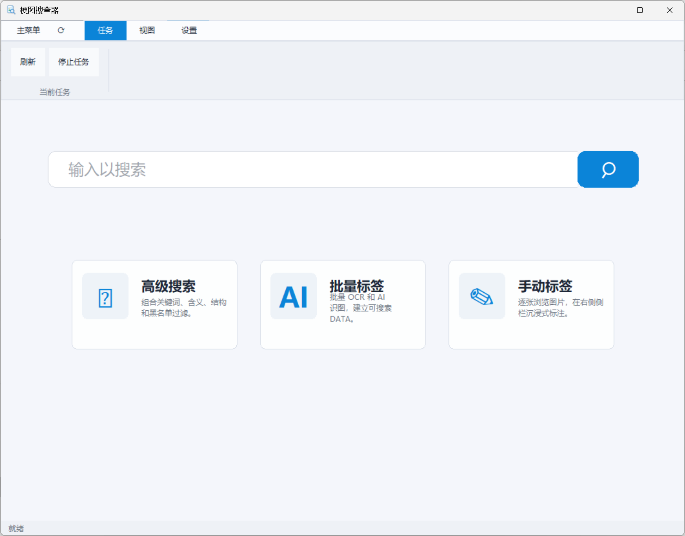
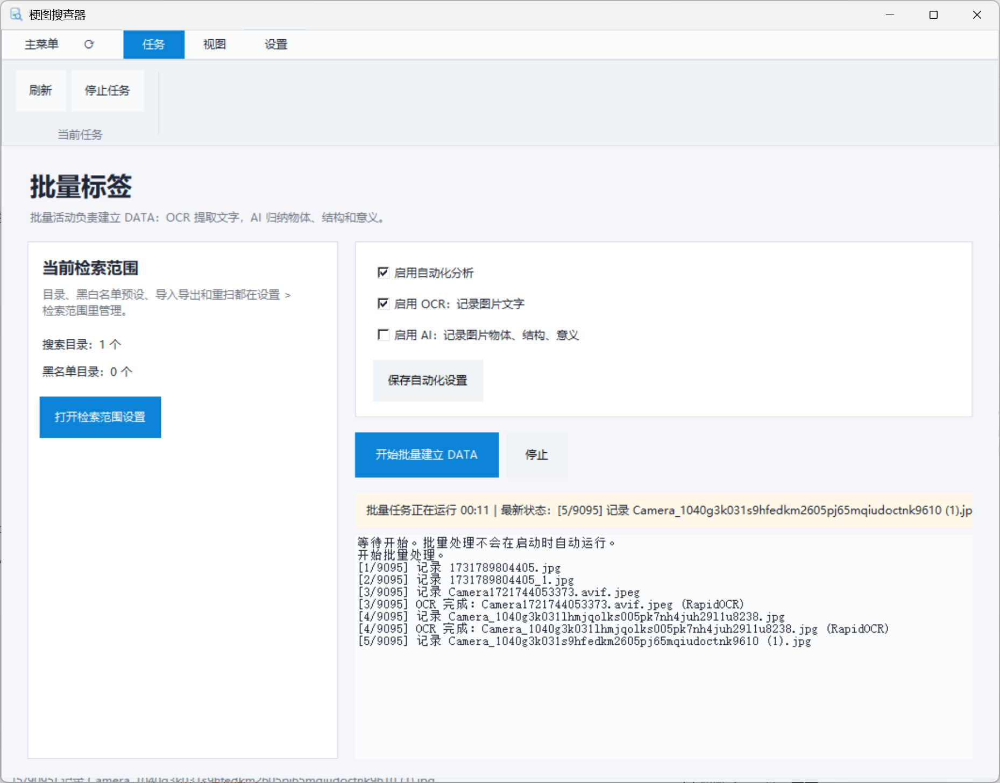
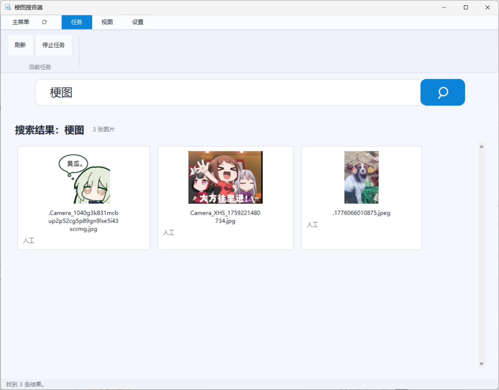
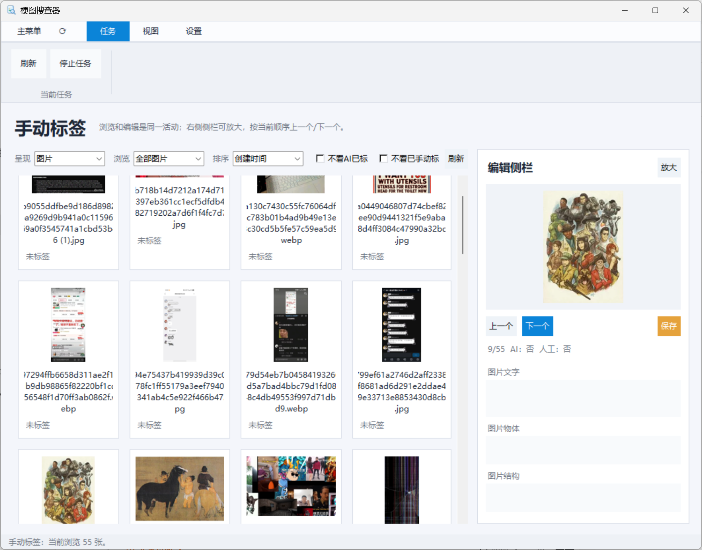
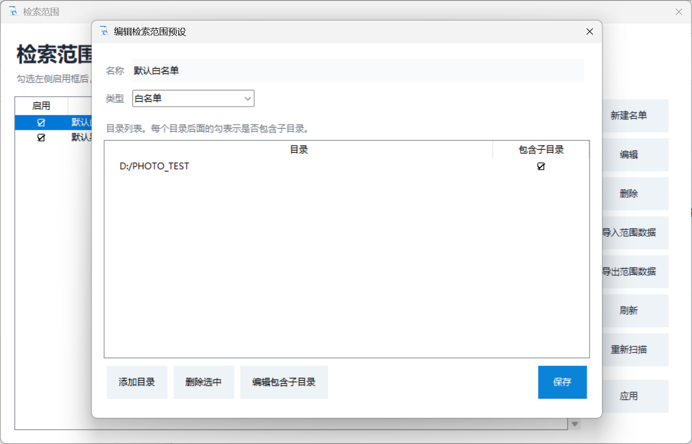
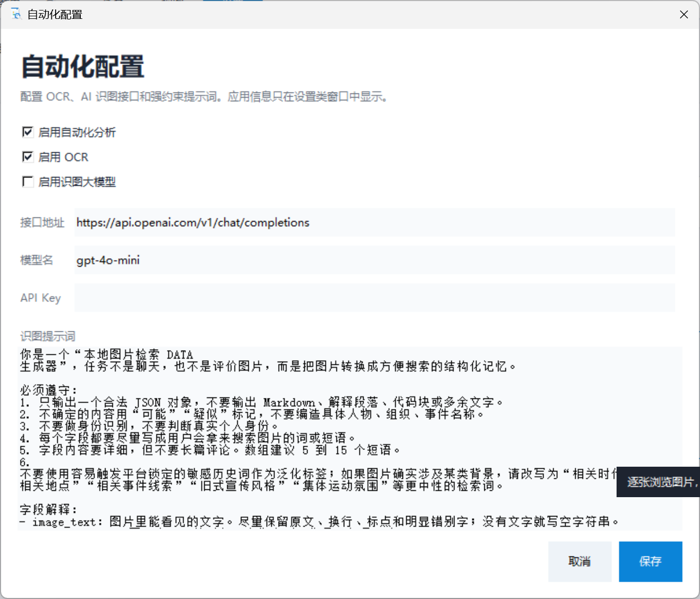
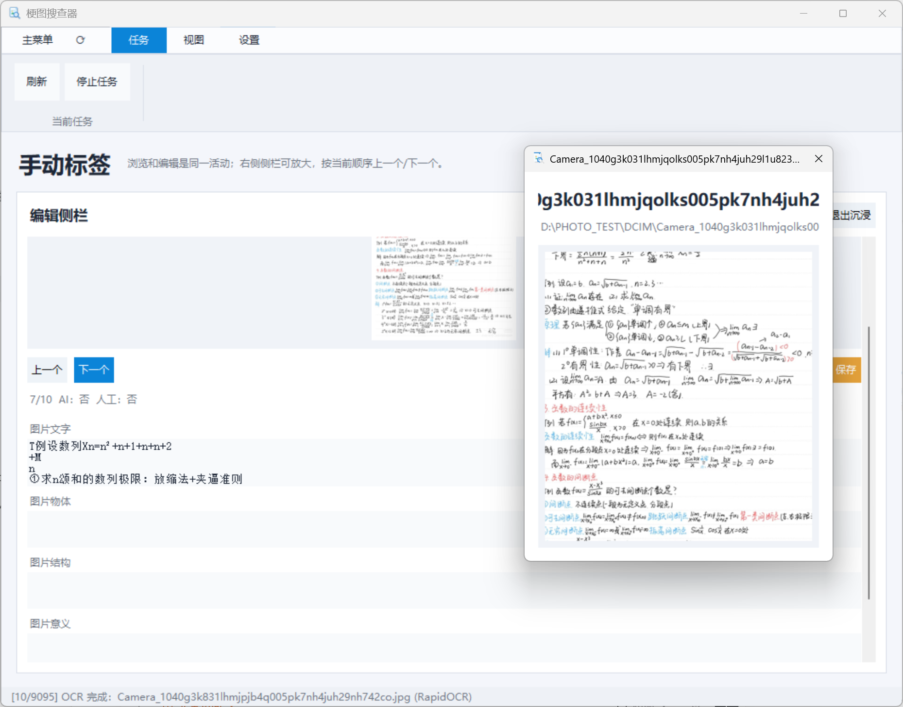

# MemeFinder / 梗图搜查器

**Turn a folder full of forgotten images into a searchable visual memory library.**  
**把一堆“想得起来一点、但找不到文件名”的图片，变成可以用文字、画面内容和含义快速检索的本地资料库。**

[Download latest Setup / 下载最新版安装包](https://github.com/Iraryi/MemeFinder/releases/latest/download/MemeFinder-Setup.exe)

  

---

## Interface Preview / 界面预览

| Build searchable DATA | Search by remembered words |
| --- | --- |
|  |  |

| Manual tagging and preview | Search scope management |
| --- | --- |
|  |  |

| OCR and API settings | Image detail preview |
| --- | --- |
|  |  |

  
  Screenshot note: sample images shown in the screenshots are used only to demonstrate the interface, search behavior, OCR, and tagging workflow. Copyrights and other rights remain with their respective owners. The project does not claim ownership of those example images, and they are not distributed as a bundled dataset.
  

---

<strong>中文介绍：点击展开 / 收起</strong>

## 这是什么？

梗图搜查器是一个本地图片检索工具。它适合管理梗图、聊天截图、表情包、资料截图、设计参考、手写笔记、游戏截图、视频帧等大量图片。

传统文件管理只能靠文件名和目录；梗图搜查器会给图片建立可搜索的“记忆字段”，例如图片里出现的文字、画面中有哪些物体、图片结构是什么、这张图大概表达什么、你自己补充的备注是什么。

之后你就可以用很短的关键词找图，例如：

- 表情包 无语
- 聊天截图 红字
- 手写笔记 极限
- 古画 马
- 狗 兄弟
- 截图 表格

## 主要功能

- **图片文字标注**：记录图片中出现的文字，让截图、梗图、手写笔记、聊天记录都能被搜索。
- **OCR 批量识别**：使用内置 OCR 流程批量提取图片文字，快速建立基础 DATA。
- **大模型 API 批量标注**：可选接入 OpenAI-compatible 图像理解接口，让程序归纳图片里的物体、结构和含义。
- **手动标注**：逐张浏览图片，手动补充“图片文字、图片物体、图片结构、图片意义、备注”。
- **关键词搜索**：输入一个词，就能从已经标注过的图片中找到相关结果。
- **范围管理**：可设置搜索目录、黑名单、白名单预设，避免把无关目录混入资料库。
- **备份与迁移辅助**：完整 DATA、标签数据和检索范围可以导入导出；实验性 Tag Data Editor 可作为标签数据批量修正工具。

## 基本流程

1. 安装并启动 MemeFinder。
2. 第一次启动时选择语言。
3. 在检索范围里添加你的图片目录。
4. 进入批量标签，启用 OCR；如果需要更丰富的“物体、结构、意义”描述，可以配置大模型 API。
5. 等待程序建立本地 DATA。
6. 回到主界面输入关键词搜索。
7. 对重要图片使用手动标签补充更准确的文字和备注。

## 适合哪些场景？

- 梗图和表情包收藏太多，想按含义或文字找图。
- 聊天截图、网页截图、资料截图需要长期归档。
- 手写笔记、课件截图、研究图片需要按关键词回忆。
- 设计参考、UI 截图、视频帧、游戏截图需要快速定位。
- 想把本地图片资料库整理成可搜索的个人视觉记忆库。

## 隐私说明

MemeFinder 默认在本地建立 DATA。OCR、手动标注和搜索都可以在本机完成。只有当你主动启用并配置大模型 API 时，图片分析请求才会发送到你设置的接口。

---

<strong>English Introduction: click to expand / collapse</strong>

## What is MemeFinder?

MemeFinder is a local image search and annotation tool for large personal image collections: memes, chat screenshots, stickers, reference images, handwritten notes, game screenshots, video frames, and more.

Instead of relying only on file names and folders, MemeFinder builds searchable memory fields for each image: visible text, objects, visual structure, semantic meaning, and your own notes.

Then you can search with short memory-style keywords such as:

- reaction image awkward
- chat screenshot red text
- handwritten notes limit
- old painting horse
- dog meme
- screenshot table

## Core features

- **Text annotation for images**: store visible text so screenshots, memes, notes, and chat images become searchable.
- **Batch OCR**: extract text from many images and build a local searchable DATA library.
- **AI API tagging**: optionally connect an OpenAI-compatible vision API to summarize objects, structure, and meaning.
- **Manual tagging**: browse images one by one and refine text, objects, structure, meaning, and notes.
- **Keyword search**: type a word and instantly find images whose annotations contain it.
- **Search scope management**: configure root folders, blacklists, whitelist presets, and rescanning behavior.
- **Backup and migration helpers**: DATA, tag data, and search scopes can be imported or exported; the experimental Tag Data Editor can help batch-fix exported tag data.

## Basic workflow

1. Install and launch MemeFinder.
2. Choose a language on first launch.
3. Add your image folders in Search Scope.
4. Open Batch Tagging and enable OCR. Configure a vision API if you want richer object, structure, and meaning annotations.
5. Let MemeFinder build the local DATA library.
6. Search from the home page with remembered words.
7. Use Manual Tagging to improve important images.

## Good use cases

- Find memes and reaction images by text, mood, or meaning.
- Archive chat screenshots, web screenshots, and information screenshots.
- Search handwritten notes, course screenshots, research images, and visual materials.
- Manage design references, UI screenshots, video frames, and game screenshots.
- Build a searchable private visual memory library on your own machine.

## Privacy note

MemeFinder builds its DATA locally by default. OCR, manual tagging, and search can run on your own machine. Images are sent to an external service only if you explicitly enable and configure a vision API endpoint.

---

## Download / 下载

Download the latest installer from the Release page:

[MemeFinder-Setup.exe](https://github.com/Iraryi/MemeFinder/releases/latest/download/MemeFinder-Setup.exe)

## Build from source / 从源码构建

    py -3.10 -m pip install -r requirements.txt
    .\build.ps1
    .\build_setup.ps1

Generated installer:

    release\MemeFinder-Setup.exe

